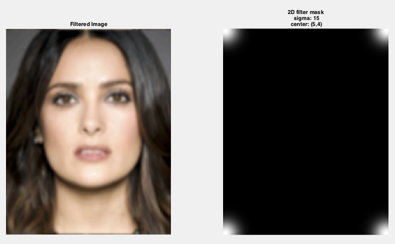
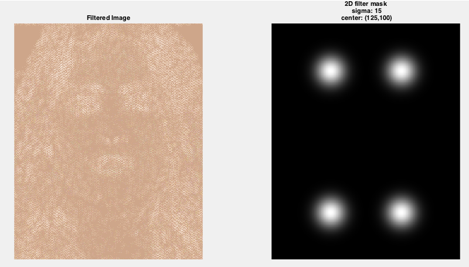
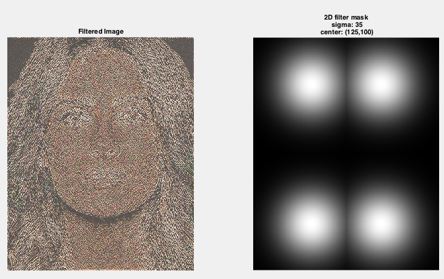
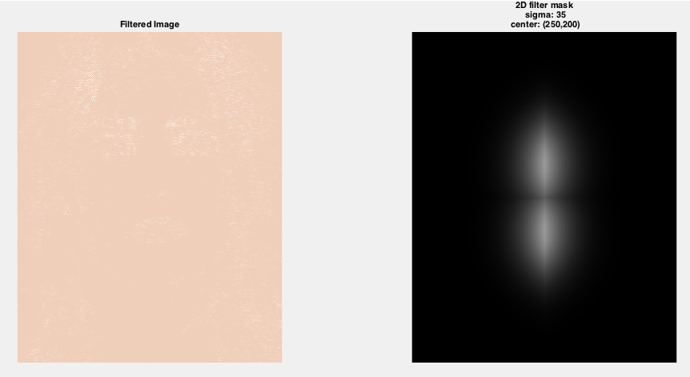

# imageFilter
### 2D Gaussian spatial filtering tool for use with Matlab

Apply spatial frequency filtering to specified input image. The filter takes the form of a Gaussian kernel applied as a mask to the 2D frequency domain of the given image. The size and location of the kernel can be set by the user.

Output image written to same directory as input image. 

## Usage
`imageFilter(image_path, kSigma, [kx ky])`

*  **image_path**: path to the image you want to filter
*  **kSigma**: FWHM (full width half max) of Gaussian kernel
*  **[kx, ky]**: x,y coordinates of kernel location. Expressed as a percentage of image width and image height, respectively. *Note: Due to real and imaginary parts of the frequency domain, these values should be in the range of 0-0.5*

## Examples:
**source image:**

### Low-Pass Filter
Low spatial frequencies found in top-left corner of 2D frequency domain. Position mask in this corner will permit only low spatial frequency information to pass. 

`imageFilter('sourceImage.jpg', 15, [0.01 0.01])`

### Mid-Pass Filter
Positioning the mask half-way between the lowest and highest spatial frequencies present will produce a mid-pass filtered image

`imageFilter('sourceImage.jpg', 15, [0.25 0.25])`

Widening the kernel will expand the range of frequencies that are a allowed to pass through

`imageFilter('sourceImage.jpg', 35, [0.25 0.25])`

### High-Pass Filter
High spatial frequencies occur at the center of 2D frequency domain. Note that the highest frequencies represent a spatial pattern that is alternating with every other pixel along a given dimension. Depending on the source image, this pattern may not be strongly represnted in your image, and you may wish to move the kernel outwards in order to generate a "high" pass filter appropriate to your image.  

`imageFilter('sourceImage.jpg', 35, [0.15 0.15])`

